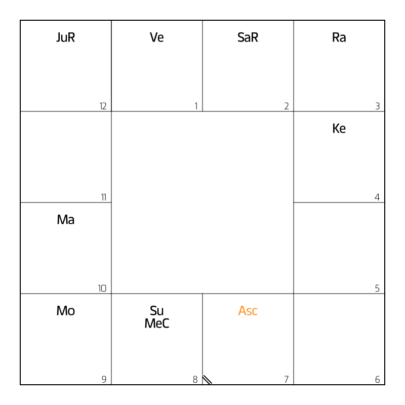
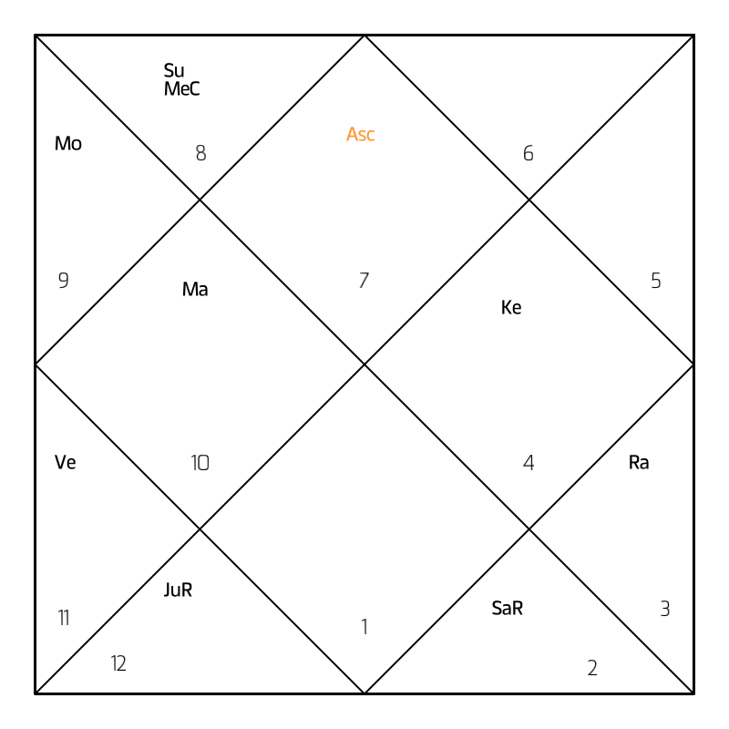

# Go Vedic Astro Charts

A Go library for generating Vedic astrology charts in different styles: North Indian and South Indian.

## Features

- Generates charts in two different styles:
  - **South Indian**: Fixed rashi positions (1-12 always in same positions), planets placed based on their rashi
  - **North Indian**: Fixed rashi positions with rotating house system based on Lagna
- Supports all 9 planets (Sun, Moon, Mars, Mercury, Jupiter, Venus, Saturn, Rahu, Ketu)
- Supports upagrahas (Upaketu, Mandi, Gulika, etc.)
- Handles retrograde (R) and combust (C) indicators
- Custom display names for planets/upagrahas
- Center text support for South Indian charts
- Returns base64-encoded PNG images

## Installation

```bash
go get github.com/tejzpr/go-vedic-astro-charts
```

## Usage

```go
package main

import (
    "encoding/base64"
    "fmt"
    "os"
    "github.com/tejzpr/go-vedic-astro-charts"
)

func main() {
    input := parashari.ChartInput{
        ChartType: parashari.ChartTypeSouth, // or ChartTypeNorth
        Lagna: &parashari.Planet{
            Rashi: "leo", // Lagna rashi (ascendant sign)
        },
        Planets: map[string]*parashari.Planet{
            "sun": {
                Rashi:        "taurus",
                IsRetrograde: false,
                IsCombust:    false,
            },
            "jupiter": {
                Rashi:        "taurus",
                IsRetrograde: true,
                IsCombust:    false,
            },
            "moon": {
                Rashi:        "gemini",
                IsRetrograde: false,
                IsCombust:    false,
            },
            "upaketu": {
                Rashi:      "scorpio",
                IsUpagraha: true,
            },
        },
        CenterText: "Custom Text\nLine 2", // Optional: for South Indian charts only
    }

    // Generate chart
    base64Image, err := parashari.GenerateChart(input)
    if err != nil {
        fmt.Printf("Error: %v\n", err)
        return
    }

    // Decode and save
    imageData, _ := base64.StdEncoding.DecodeString(base64Image)
    os.WriteFile("chart.png", imageData, 0644)
}
```

## Input Format

The input requires:
- `chart_type`: One of `"north"` or `"south"`
- `lagna`: (Optional) Lagna (Ascendant) planet object with:
  - `rashi`: Zodiac sign name where Lagna is located
  - Note: Lagna is never retrograde or combust (it's a point, not a planet)
- `planets`: A map of planet names to planet data, where each planet has:
  - `rashi`: Zodiac sign name (e.g., "aries", "taurus", "gemini", etc.)
  - `is_retrograde`: Boolean indicating retrograde status (adds "R" suffix)
  - `is_combust`: Boolean indicating combust status (adds "C" suffix)
  - `upagraha`: (Optional) Boolean indicating if this is an upagraha
  - `display`: (Optional) Custom display name (overrides default abbreviation)
- `center_text`: (Optional) Multi-line text to display in center of South Indian chart

### Supported Planet Names
- `"sun"`, `"moon"`, `"mars"`, `"mercury"`, `"jupiter"`, `"venus"`, `"saturn"`, `"rahu"`, `"ketu"`
- `"lagna"` (for ascendant, displayed as "Asc" in saffron color)

### Supported Upagraha Names
- `"upaketu"` (displayed as "Up"), `"mandi"` (displayed as "Mn"), `"gulika"` (displayed as "Gu")
- `"yamaghantaka"` (Ya), `"ardhaprahara"` (Ar), `"kala"` (Ka), `"dhuma"` (Dh)
- `"vyatipata"` (Vy), `"parivesha"` (Pa), `"indrachapa"` (In)

### Supported Rashi Names
- `"aries"`, `"taurus"`, `"gemini"`, `"cancer"`, `"leo"`, `"virgo"`, `"libra"`, `"scorpio"`, `"sagittarius"`, `"capricorn"`, `"aquarius"`, `"pisces"`

## Chart Types

### South Indian Chart
- Fixed rashi positions: Rashi numbers (1-12) are always in the same positions
  - Position 1 = Aries, Position 2 = Taurus, ..., Position 12 = Pisces
- Planets are placed in the box corresponding to their rashi number
- Lagna (Ascendant) is displayed as "Asc" in saffron color in the box of its rashi
- Lagna indicator: Two parallel diagonal lines at bottom-left corner of the lagna rashi box
- Center text: Optional multi-line text can be displayed in the center (4 empty squares)
- Perimeter layout: 12 boxes around the perimeter, center 4 squares are empty



### North Indian Chart
- Fixed rashi positions with rotating house system
- Diamond-shaped layout with inner and outer rotated squares
- Lagna rashi number appears at the top-right of the 45-degree rotated inner square
- Rashi numbers rotate counter-clockwise from lagna position
- Planets are displayed near their respective rashi numbers
- Lagna (Ascendant) is displayed as "Asc" in saffron color



## Planet Display

- **Planets**: Displayed with abbreviations (Su, Mo, Ma, Me, Ju, Ve, Sa, Ra, Ke)
- **Lagna**: Displayed as "Asc" in saffron color (RGB: 1.0, 0.6, 0.2)
- **Upagrahas**: Displayed by their names/abbreviations (Up, Mn, Gu, etc.)
- **Retrograde**: Adds "R" suffix (e.g., "JuR")
- **Combust**: Adds "C" suffix (e.g., "VeC")
- **Custom Display**: Use `display` field to override default abbreviation

## Output

The library returns a base64-encoded PNG string that can be:
- Decoded and saved as a PNG file
- Embedded in HTML as a data URI
- Sent over HTTP as an image response

## Dependencies

- `github.com/fogleman/gg` - Graphics library for drawing
- `golang.org/x/image` - Image processing and fonts

## Fonts

The library uses the Matangi font family for rendering:
- `Matangi-Regular.ttf` for rashi numbers
- `Matangi-Bold.ttf` for planet names
- Falls back to basic font if Matangi fonts cannot be loaded

**Font Embedding**: Fonts are automatically embedded into the binary using Go's `go:embed` directive. When you build your application, the font files are included in the compiled binary, so you don't need to distribute font files separately. The fonts are loaded from embedded data at runtime.

Font files are located at: `fonts/matangi/fonts/ttf/` in the source code, but are embedded during compilation.

## License

This program is free software: you can redistribute it and/or modify
it under the terms of the GNU Affero General Public License as published by
the Free Software Foundation, either version 3 of the License, or
(at your option) any later version.

This program is distributed in the hope that it will be useful,
but WITHOUT ANY WARRANTY; without even the implied warranty of
MERCHANTABILITY or FITNESS FOR A PARTICULAR PURPOSE.  See the
GNU Affero General Public License for more details.

You should have received a copy of the GNU Affero General Public License
along with this program.  If not, see <https://www.gnu.org/licenses/>.

Copyright (c) 2024 Tejus Pratap <tejzpr@gmail.com>

